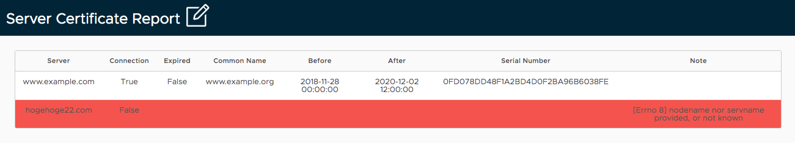

# Ansible Server Certificate Report Generator

Ansible Server Certificate Report Generator can generate the following certificate report.  
In this example I will generate a HTML report using the template module from certificate information I have gathered with the server_certificate_info module.



## Install

Clone this repository and install ansible and the required python modules.

```
$ clone https://github.com/sky-joker/ansible-server-certificate-report-generator.git
$ cd ansible-server-certificate-report-generator
$ pip install ansible
$ pip install -r requirements.txt
```

## Usage

### Create the playbook

How to use is very easy.  
Create the next Playbook and add the server list you want to get the certificate to `servers` variable.

```yaml
---
- name: Generate of server certificate report
  hosts: localhost
  gather_facts: no
  vars:
    servers:
      - www.example.com
      - 192.168.0.111
  tasks:
    - name: Get certificate information from server.
      server_certificate_info:
        server: "{{ item }}"
      loop: "{{ servers }}"
      register: certificate_result

    - name: Generate report.
      template:
        src: templates/server_certificate_report.j2
        dest: server_certificate_report.html
```

### Running the playbook

Run playbook using `ansible-playbook` command:

```
$ ansible-playbook example.yml
 [WARNING]: No inventory was parsed, only implicit localhost is available

 [WARNING]: provided hosts list is empty, only localhost is available. Note that the implicit localhost does not match 'all'


PLAY [Generate of server certificate report] *******************************************************************************************************************************

TASK [Get certificate information from server.] ****************************************************************************************************************************
ok: [localhost] => (item=www.example.com)
ok: [localhost] => (item=192.168.0.111)

TASK [Generate report.] ****************************************************************************************************************************************************
changed: [localhost]

PLAY RECAP *****************************************************************************************************************************************************************
localhost                  : ok=2    changed=1    unreachable=0    failed=0    skipped=0    rescued=0    ignored=0
```

## License

[GPL-3.0](https://www.gnu.org/licenses/agpl-3.0.txt)
